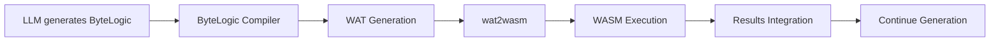

# ByteLogic Migration Plan: From WAT to ByteLogic-WASM

**Version:** 1.0  
**Date:** 2026-01-19  
**Purpose:** Replace direct WAT computation tokens with ByteLogic compiled to WASM for structured reasoning  

---

## Executive Summary

This document outlines the migration from pure WebAssembly Text (WAT) computation tokens to ByteLogic-compiled WASM. The goal is to enable structured logic programming and datalog-style reasoning within the LLM's computation-as-reasoning framework while maintaining the security and deterministic benefits of WASM execution.

### Key Changes

| Component | Current State | Target State |
|-----------|---------------|--------------|
| **Computation Tokens** | `<computed>result</computed>` | `<computation>bytelog_code</computation>` |
| **Code Format** | Direct WAT assembly | ByteLogic datalog-like syntax |
| **Compilation** | WAT → WASM directly | ByteLogic → WAT → WASM |
| **Reasoning Type** | Arithmetic only | Logic programming + arithmetic |
| **Training Data** | WAT examples | ByteLogic examples |

---

## 1. Current System Analysis

### 1.1 Existing Token Structure
```
Input: "Calculate 17 × 23"
Current Output: "17 × 23 = <computed>391</computed>"
```

**WAT Example in Training Data:**
```wat
(module
  (func (export "compute") (param $0 f64) (param $1 f64) (result f64)
    local.get $0
    local.get $1
    f64.mul))
```

### 1.2 Current Components

1. **WATTokenizer** (`src/tokenization/wat_tokenizer.py`)
   - Tokenizes WAT syntax for transformer training
   - Handles WASM opcodes, functions, control structures
   - Special tokens: `<wat_start>`, `<wat_end>`, `<computed>`, `</computed>`

2. **WASMExecutor** (`src/execution/wasm_executor.py`)
   - Compiles WAT to WASM using `wat2wasm`
   - Executes WASM using `wasmtime` Python runtime
   - Returns results in `<computed>` format

3. **Training Pipeline** (`src/training/wasm_dataset.py`)
   - Extracts `<computed>` tokens from training data
   - Validates WAT compilation during training

### 1.3 Limitations of Current System

- **Limited to arithmetic**: Only basic mathematical operations
- **Low-level syntax**: WAT is assembly-like, hard for LLMs to generate reliably
- **No logical reasoning**: Cannot express datalog relationships, rules, or queries
- **Manual compilation**: Requires hand-writing WAT for each operation

---

## 2. Target Architecture

### 2.1 New Token Structure
```
Input: "Who are Alice's descendants through Bob?"
Target Output: "Alice's descendants: <computation>
REL parent
REL descendant
FACT parent alice bob
FACT parent bob charlie
RULE descendant: SCAN parent, EMIT descendant $0 $1
RULE descendant: SCAN parent, JOIN descendant $1, EMIT descendant $0 $2
SOLVE
QUERY descendant alice ?
</computation> → charlie, david"
```

### 2.2 ByteLogic Integration Flow



### 2.3 Component Architecture

```
worldmodel/
├── bytelogic/                    # Git submodule
│   ├── build/bytelogic           # Compiler executable
│   └── examples/                 # Reference programs
├── src/
│   ├── execution/
│   │   ├── bytelogic_executor.py # New: ByteLogic→WASM executor
│   │   └── wasm_executor.py      # Updated: Handle ByteLogic output
│   ├── tokenization/
│   │   ├── bytelogic_tokenizer.py # New: ByteLogic syntax tokenizer
│   │   └── wat_tokenizer.py      # Deprecated
│   └── training/
│       ├── bytelogic_dataset.py  # New: ByteLogic training examples
│       └── wasm_dataset.py       # Updated: Support both formats
└── spec/
    ├── bytelogic-training-curriculum.md
    └── computation-token-spec.md
```

---

## 3. Migration Implementation Plan

### 3.1 Phase 1: Infrastructure Setup ✅

**Status: COMPLETED**
- ✅ Add bytelogic as git submodule
- ✅ Verify bytelogic compilation works
- ✅ Read ByteLogic specifications and examples

### 3.2 Phase 2: New Tokenization System

**Deliverables:**
1. **ByteLogicTokenizer** (`src/tokenization/bytelogic_tokenizer.py`)
   - Tokenize ByteLogic syntax (REL, FACT, RULE, SCAN, JOIN, EMIT, SOLVE, QUERY)
   - Handle variables ($0, $1, $2), atoms (alice, bob), relations
   - Special tokens: `<computation>`, `</computation>`, `<result>`, `</result>`

2. **Updated Token Vocabulary**
```python
# Core ByteLogic keywords
BYTELOGIC_TOKENS = {
    "REL", "FACT", "RULE", "SCAN", "JOIN", "EMIT", "SOLVE", "QUERY",
    "MATCH", "WHERE", "CALC", "INPUT", "LET", "RESULT", "IF", "THEN", "ELSE", "END"
}

# Special computation tokens
SPECIAL_TOKENS = {
    "<computation>", "</computation>", 
    "<result>", "</result>",
    "<logic>", "</logic>"
}
```

### 3.3 Phase 3: Execution Engine

**Deliverables:**
1. **ByteLogicExecutor** (`src/execution/bytelogic_executor.py`)
```python
class ByteLogicExecutor:
    def execute_bytelogic(self, bl_code: str, inputs: Optional[Dict] = None) -> Dict:
        """
        Execute ByteLogic code through compilation pipeline.
        
        Args:
            bl_code: ByteLogic source code
            inputs: Optional facts to inject
        
        Returns:
            {
                "success": bool,
                "result": Any,
                "query_results": List[Tuple],
                "computation_token": str,
                "wat_code": str  # For debugging
            }
        """
```

**Compilation Pipeline:**
```python
def compile_and_execute(self, bl_code: str) -> Dict:
    # Step 1: Write ByteLogic to temp file
    with tempfile.NamedTemporaryFile(suffix='.bl') as bl_file:
        bl_file.write(bl_code.encode())
        
        # Step 2: Compile ByteLogic to WAT
        wat_result = subprocess.run([
            './bytelogic/build/bytelogic', 
            '--compile=wat', 
            bl_file.name
        ], capture_output=True, text=True)
        
        # Step 3: Compile WAT to WASM and execute
        return self.wasm_executor.execute_wat(wat_result.stdout)
```

2. **Integration with existing WASMExecutor**
   - Update `execute_wat` to handle ByteLogic-generated WAT
   - Add query result parsing for datalog outputs
   - Maintain backward compatibility for direct WAT

### 3.4 Phase 4: Training Data Generation

**Deliverables:**
1. **ByteLogic Training Curriculum** (`spec/bytelogic-training-curriculum.md`)
2. **Training Examples Generator** (`src/training/bytelogic_dataset.py`)
3. **Example Categories:**

#### 4.1 Family Relationships
```bytelogic
REL parent
REL grandparent
FACT parent alice bob
FACT parent bob charlie
RULE grandparent: SCAN parent MATCH $0, JOIN parent $0, EMIT grandparent $1 $2
SOLVE
QUERY grandparent alice ?
```

#### 4.2 Graph Reachability  
```bytelogic
REL edge
REL reachable
FACT edge a b
FACT edge b c
RULE reachable: SCAN edge, EMIT reachable $0 $1
RULE reachable: SCAN edge, JOIN reachable $1, EMIT reachable $0 $2
SOLVE
QUERY reachable a c
```

#### 4.3 Classification Hierarchies
```bytelogic
REL isa
REL has_property
FACT isa tweety bird
FACT isa bird animal
FACT has_property bird flies
RULE isa: SCAN isa, JOIN isa $1, EMIT isa $0 $2
RULE has_property: SCAN isa, JOIN has_property $1, EMIT has_property $0 $2
SOLVE
QUERY has_property tweety ?
```

#### 4.4 Mathematical Calculations (ByteLogic 3.0)
```bytelogic
CALC factorial
  INPUT $0
  IF $0 <= 1 THEN
    RESULT 1
  ELSE
    LET $1 = CALC factorial($0 - 1)
    RESULT $0 * $1
  END
END

RESULT CALC factorial(5)
```

### 3.5 Phase 5: Model Integration

**Deliverables:**
1. **Updated Model Adapter** (`src/models/qwen_wasm_adapter.py`)
   - Detect `<computation>` tokens during generation
   - Extract ByteLogic code and execute via ByteLogicExecutor  
   - Insert results back into generation stream
   - Handle both legacy `<computed>` and new `<computation>` formats

2. **Token Processing Pipeline**
```python
def process_computation_token(self, text: str) -> str:
    # Extract ByteLogic code
    computation_match = re.search(r'<computation>(.*?)</computation>', text, re.DOTALL)
    if computation_match:
        bl_code = computation_match.group(1).strip()
        
        # Execute ByteLogic
        result = self.bytelogic_executor.execute_bytelogic(bl_code)
        
        # Format result
        if result["success"]:
            result_token = f"<result>{result['result']}</result>"
            return text.replace(computation_match.group(0), result_token)
    
    return text
```

---

## 4. Training Data Strategy

### 4.1 Curriculum Design

**Stage 1: Basic Logic (Weeks 1-2)**
- Simple facts and queries
- Single-step inference rules
- Family relationships, basic classification

**Stage 2: Complex Logic (Weeks 3-4)**  
- Multi-step inference chains
- Transitive closure patterns
- Graph algorithms in logic

**Stage 3: Hybrid Reasoning (Weeks 5-6)**
- Logic + calculation integration
- ByteLogic 3.0 features (CALC blocks)
- Complex problem solving

**Stage 4: Advanced Applications (Weeks 7-8)**
- Real-world reasoning scenarios
- Multi-domain problem solving
- Performance optimization

### 4.2 Training Example Format

```json
{
  "input": "Who are all the people Alice can influence through her management hierarchy?",
  "reasoning_steps": [
    "I need to find transitive relationships through management chains.",
    "Let me model this as a graph reachability problem using ByteLogic."
  ],
  "computation": "REL manages\nREL influences\nFACT manages alice bob\nFACT manages bob charlie\nRULE influences: SCAN manages, EMIT influences $0 $1\nRULE influences: SCAN manages, JOIN influences $1, EMIT influences $0 $2\nSOLVE\nQUERY influences alice ?",
  "expected_result": ["bob", "charlie", "david"],
  "output": "Alice can influence: <computation>REL manages\nREL influences\nFACT manages alice bob\nFACT manages bob charlie\nRULE influences: SCAN manages, EMIT influences $0 $1\nRULE influences: SCAN manages, JOIN influences $1, EMIT influences $0 $2\nSOLVE\nQUERY influences alice ?</computation> → bob, charlie, david through her management hierarchy."
}
```

### 4.3 Training Data Volume

**Target: 5,000+ examples across all categories**
- 1,000 basic logic examples
- 1,500 complex reasoning chains  
- 1,000 hybrid logic+calculation
- 1,500 real-world applications

---

## 5. Implementation Timeline

### Week 1-2: Core Infrastructure
- [ ] Implement ByteLogicTokenizer
- [ ] Create ByteLogicExecutor  
- [ ] Integration testing with bytelogic compiler
- [ ] Basic example validation

### Week 3-4: Training Pipeline
- [ ] Generate Stage 1 training data (basic logic)
- [ ] Update model training pipeline
- [ ] Test computation token processing
- [ ] Validate compilation and execution

### Week 5-6: Advanced Features  
- [ ] Implement ByteLogic 3.0 calculation features
- [ ] Generate Stage 2-3 training data
- [ ] Performance optimization
- [ ] Error handling and recovery

### Week 7-8: Production Integration
- [ ] Generate Stage 4 training data
- [ ] Full model retraining
- [ ] Integration testing  
- [ ] Documentation and deployment

---

## 6. Migration Strategy

### 6.1 Backward Compatibility

**Phase A: Dual Support (Weeks 1-4)**
- Support both `<computed>` and `<computation>` tokens
- Maintain existing WAT execution path
- Add ByteLogic execution path in parallel

**Phase B: Gradual Migration (Weeks 5-6)**  
- Prioritize ByteLogic for new training data
- Convert existing WAT examples to ByteLogic equivalents
- Update model to prefer `<computation>` tokens

**Phase C: Full Migration (Weeks 7-8)**
- Deprecate direct WAT generation
- Remove `<computed>` token support
- Full ByteLogic-only training

### 6.2 Risk Mitigation

**Compilation Failures:**
- Robust error handling in ByteLogicExecutor
- Fallback to simulation for malformed ByteLogic
- Comprehensive testing with edge cases

**Performance Regression:**
- Benchmark ByteLogic compilation times
- Optimize hot paths in execution pipeline  
- Cache compiled WASM modules

**Training Data Quality:**
- Automated validation of ByteLogic examples
- Curriculum progression testing
- Human review of complex examples

---

## 7. Testing Strategy

### 7.1 Unit Tests

**ByteLogicExecutor Tests:**
```python
def test_simple_query():
    bl_code = """
    REL parent
    FACT parent alice bob
    SOLVE  
    QUERY parent alice ?
    """
    result = executor.execute_bytelogic(bl_code)
    assert result["success"] == True
    assert "bob" in result["query_results"]

def test_transitive_closure():
    bl_code = """
    REL parent
    REL ancestor
    FACT parent alice bob
    FACT parent bob charlie
    RULE ancestor: SCAN parent, EMIT ancestor $0 $1
    RULE ancestor: SCAN parent, JOIN ancestor $1, EMIT ancestor $0 $2
    SOLVE
    QUERY ancestor alice ?
    """
    result = executor.execute_bytelogic(bl_code)
    expected = ["bob", "charlie"]
    assert all(person in result["query_results"] for person in expected)
```

### 7.2 Integration Tests

**End-to-End Pipeline:**
- Generate ByteLogic from model  
- Compile and execute
- Parse results
- Continue generation

**Training Data Validation:**
- Syntax validation for all examples
- Compilation testing
- Expected result verification

### 7.3 Performance Tests

**Compilation Speed:**
- Target: <100ms for simple programs
- Target: <500ms for complex programs

**Execution Speed:**  
- Target: <50ms for basic queries
- Target: <200ms for complex inference

---

## 8. Documentation Plan

### 8.1 Developer Documentation

1. **ByteLogic Integration Guide** (`docs/bytelogic-integration.md`)
2. **Computation Token Specification** (`spec/computation-token-spec.md`)  
3. **Training Data Format** (`docs/bytelogic-training-format.md`)
4. **API Reference** (`docs/bytelogic-api.md`)

### 8.2 Training Curriculum

1. **ByteLogic Language Guide** (`spec/bytelogic-training-curriculum.md`)
2. **Example Library** (`training/examples/bytelogic/`)
3. **Progressive Difficulty Stages** (`training/curriculum/`)

---

## 9. Success Metrics

### 9.1 Technical Metrics

- **Compilation Success Rate:** >99% for valid ByteLogic  
- **Execution Performance:** <100ms average for simple queries
- **Training Data Quality:** 100% syntactically valid examples
- **Model Integration:** Seamless computation token processing

### 9.2 Capability Metrics

- **Reasoning Complexity:** Handle 5+ inference steps
- **Problem Domains:** Support 10+ different reasoning types
- **Accuracy:** >95% correct results for trained patterns
- **Reliability:** Deterministic, repeatable execution

---

## 10. Future Extensions

### 10.1 ByteLogic 4.0 Features
- Negation and constraints
- Aggregation operations (count, sum, max)
- Temporal reasoning
- Probabilistic logic extensions

### 10.2 Advanced Integration
- Multi-step reasoning chains
- External data source integration
- Real-time fact injection
- Distributed reasoning across multiple WASM instances

---

This migration plan provides a comprehensive roadmap for replacing direct WAT computation with ByteLogic-compiled WASM, enabling structured logical reasoning while maintaining the security and deterministic benefits of the current system.